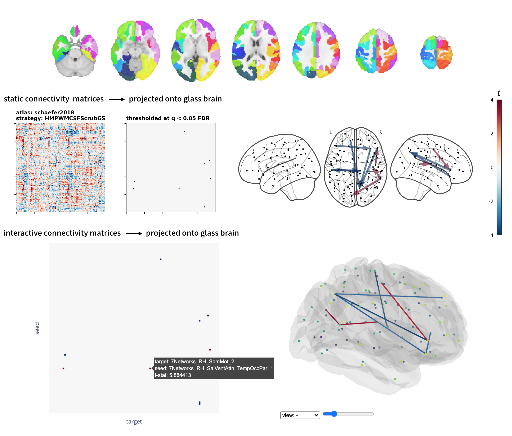

## wb_ppi
> stimulus-modulated connectivity between distributed brain regions or networks

**to run**: `python wb_ppi.py  --help`

**description**  
Whole-brain psychophysiological interactions (PPIs) measure stimulus- or task-modulated connectivity between all brain region pairs defined by an atlas parcellation. Each multiple regression model includes the target timeseries as the dependent variable, and as independent variables the a) convolved stimulus or *psychological factor* b) seed timeseries or *physiological factor* and c) product of *a x b*. Regression coefficients corresponding to *c* are saved to `wb_ppi/sub-{subject}/sub-{subject}_task-{task}_atlas-{atlas}_strat-{strategy}_ppi.npy`. These numpy matrices can be combined across runs and subjects (see `example/`) to build t-statistic matrices, while controlling the false discovery rate. Results are saved to `wb_ppi/group/atlas-{atlas}_strat-{strategy}_report.html`, where *atlas* refers to one of the available parcellations and *strategy* references to the [confound regression strategy](https://github.com/SIMEXP/load_confounds) used to denoise the post-processed fMRI data.

**references**
Di, Xin, and Bharat B. Biswal. "Toward task connectomics: examining whole-brain task modulated connectivity in different task domains." Cerebral Cortex 29.4 (2019): 1572-1583.

Gerchen, Martin Fungisai, David Bernal‐Casas, and Peter Kirsch. "Analyzing task‐dependent brain network changes by whole‐brain psychophysiological interactions: A comparison to conventional analysis." Human brain mapping 35.10 (2014): 5071-5082.  

O’Reilly, Jill X., et al. "Tools of the trade: psychophysiological interactions and functional connectivity." Social cognitive and affective neuroscience 7.5 (2012): 604-609.